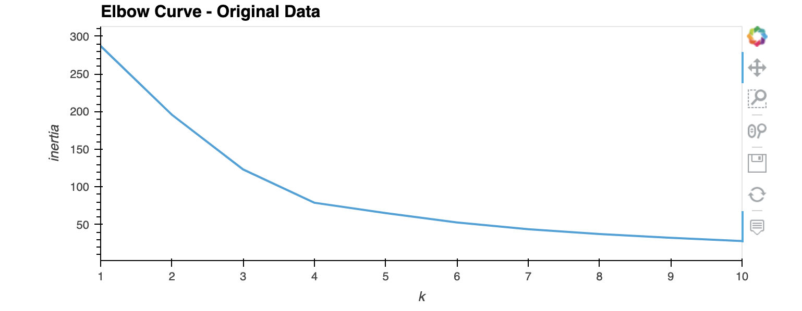

# Investment_Analysis_ML

## Analyzing Crypto Investments with Unsupervised Machine Learning

---

### Technologies

This app leverages python 3.8 with the following technologies

* [pandas](https://github.com/pandas-dev/pandas) - For data analysis and manipulation.
* [pathlib](https://github.com/jazzband/pathlib2) - For file manipulation.
* [pyviz hvplot](https://github.com/pyviz/pyviz.org) - For interactive data visualizations 
* [scikit-learn](https://github.com/scikit-learn/scikit-learn) - For ML algorithms 

---

## Installation 

1. Clone the repo 

2. Before running the program make sure to install the following dependencies:

            '''
            python
            pip install pathlib
            
            conda install -c pyviz hvplot
 
 3. Data is contained in the ***Resources*** folder and intercangeable with data of user's choice '''
 
 --- 
 
 ## Usage
 
 1. To run the program navigate to the ***crypto_investments.ipynb*** file within the repo
 
 2. The program will import, clean and analyze the data provided
 
 3. The program will first return the elbow curve and clusters of the orginal data 
 
 
 
 
 4. The program will then return the same analysis but using fewer features using PCA 
 

 
 5. The user will then have the oppurtunity to select the best method for their own data 
 
 --- 
 
 ## Contributors

The starter code was contributed by the [FinTech Bootcamp at Columbia Engineering](https://bootcamp.cvn.columbia.edu/fintech/)

Matthew Field finalized the application, his work is availble to view on [Github](https://github.com/mbf2139)

---

## License

MIT